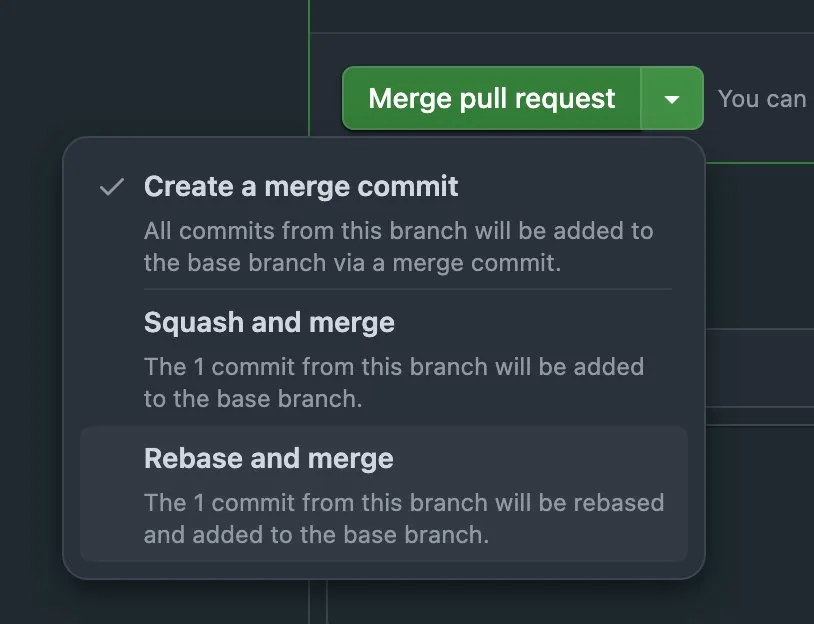
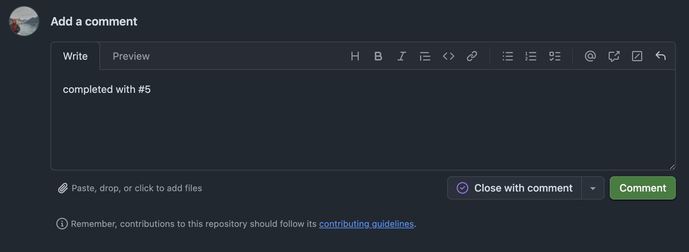

# Pull Request Guide

## 1. Open a PR

Go to the repo on GitHub. If you pushed recently, you'll see a banner — click **Compare & pull request**.

Make sure the base branch is **`dev`**, not `main`.

---

## 2. Fill in the PR form

- Target branch: `dev`
- Title: same format as commit message
- Description must include desribe task `xxxx ingtegration completed.`
- Assignee: assign yourself
- Reviewer: assign at least one teammate

---

## 3. Review process

- Reviewer checks the code and leaves comments if needed
- Address all comments, push fixes to the same branch
- Once approved, the PR is ready to merge

---

## 4. Merge — always use Rebase and merge

Click the arrow next to **Merge pull request** and select **Rebase and merge**.

> **Why rebase?** Keeps a clean, linear commit history on `dev`. No unnecessary merge commits.

---

## 5. After merge

Go to the related issue, write `Completed with #<PR-number>` and click **Close with comment**.

